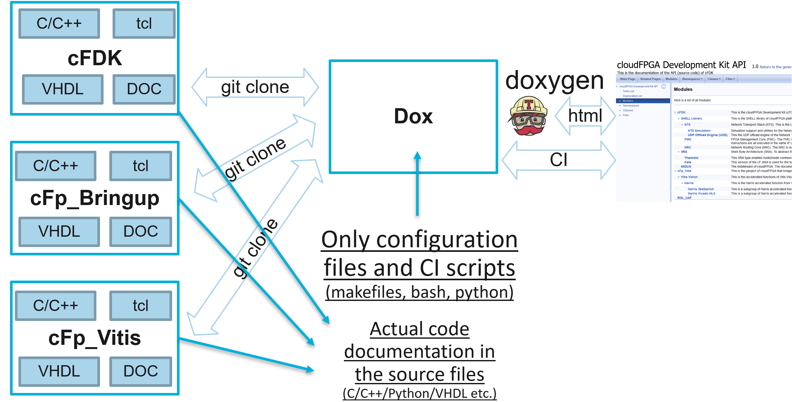

[](https://travis.ibm.com/cloudFPGA/Dox) [](https://opensource.org/licenses/Apache-2.0)


## cloudFPGA source code documentation
The repository for generating Doxygen-related html static pages only for the source code of cloudFPGA project,
i.e. cloudFPGA Development Kit (cFDK) API.

[Documentation for the source code of cloudFPGA project.](https://pages.github.ibm.com/cloudFPGA/Dox/)

**NOTE**: the generic documentation of the cloudFPGA project, including the desctiprtion of the cloudFPGA components,
tutorials etc, is maintained in a [separate repository](https://github.ibm.com/cloudFPGA/Doc/) and [is available here ](https://pages.github.ibm.com/cloudFPGA/Doc/).




### Automated documentation compilation

We adopt the following tools for automating the documentation of the source code of cloudFPGA project:
* [Travis CI](https://travis-ci.org/) is a hosted continuous integration service used to build and test software projects hosted at GitHub (both on our public and IBM enterprise repositories).
* [Doxygen](http://www.doxygen.nl/) is the de facto standard tool for generating documentation from annotated sources of several programming languages.

The overall documentation compilation process is triggered by a new commit to
[cloudFPGA Dox repository](https://github.ibm.com/cloudFPGA/Dox). Then `Travis CI` is building the documentation for
the code (C, C++, VHDL, etc.) on a containerized environment and pushes the generated static HTML files on the
`gh_pages` branch of [cloudFPGA Dox repository](https://github.ibm.com/cloudFPGA/Dox). The repository is configured
to match this branch to [GitHub Pages](https://help.github.com/en/github/working-with-github-pages/getting-started-with-github-pages)
and also bypass [jekyll](https://jekyllrb.com/) processing of `GitHub Pages` by creating an empty file named
`.nojekyll` on the repository. Eventually the final documentation
[is available here](https://pages.github.ibm.com/cloudFPGA/Dox/).

#### Update cloudFPGA API Documentation

This repository acts as a building pipeline of tasks that results in the actual documentation in static html pages.
Thus we don't host any cloudFPGA source code in this repository.
Instead the actual source code is pulled from the following repositories:

* [cloudFPGA/cFp_Vitis](https://github.ibm.com/cloudFPGA/cFp_Vitis)
* [cloudFPGA/cFDK](https://github.ibm.com/cloudFPGA/cFDK)
* [cloudFPGA/cFp_BringUp](https://github.ibm.com/cloudFPGA/cFp_BringUp)
* [cloudFPGA/cFp_Triangle](https://github.ibm.com/cloudFPGA/cFp_Triangle)

In order to edit the cFDK API documentation, you should apply the changes directly on those repositories,
i.e. source code, comment blocks, etc., [using the common Doxygen tags](http://www.doxygen.nl/manual/docblocks.html).

Then, to make the changes being reflected onto the html pages, there are two options:
1. Clone this repo, create a minor commit and push. This is useful when you also have some changes for this actual documentation repository (i.e. pipeline of tasks). The `push` request will trigger a new Travis CI building process.
2. Force a `Restart Build` job on [the Travis CI page of this repository](https://travis.ibm.com/cloudFPGA/Dox). This is useful when don't have any changes for this actual documentation repository and you only intend to keep the cFDK API documentation up to date with the source code of the cloudFPGA repositories listed above.

#### Update this documentation

```bash
git clone git@github.ibm.com:cloudFPGA/Dox.git cloudFPGA-Dox
cd cloudFPGA-Dox
< ... make your changes ... >
git push
firefox https://pages.github.ibm.com/cloudFPGA/Dox/ & (view your changes)
```

**NOTE**: the documentation compilation on Travis CI is expected to take a couple of minutes, so be patient when you submit changes until the time these take effect on the documentation.


### Logical modules hierarchy

The cloudFPGA repositories includes several directories and files that correspond to their logical components.
The file hierarchy is not strictly following the logical hierarchy. For example it may be possible that a function
which is defined in one file might be used by two or more components.

To reflect the logical hierarchy onto the documentation, we adopt the use of
[Doxygen groups](http://www.doxygen.nl/manual/grouping.html). We aim at keeping the same logical hierarchy with
the [generic cFDK documentation](https://pages.github.ibm.com/cloudFPGA/Doc/pages/cfdk.html#) hierarchy.

The main file of defining the groups and subgroups of cFDK is [LinkDef.h](https://github.ibm.com/cloudFPGA/cFDK/blob/update_md_for_doc_compatibility_did/DOC/LinkDef.h).
This file, is a header file with only comment blocks that define groups and the connection amomg them.
It is parsed by Doxygen, as a normal source code file of cFDK, since it is part of this repository.
You may extend this file with extra groups/subgroups and hierarchy depending your needs.

A basix example of creating logical modules (i.e. groups/subgroups) in this file:

```
/** \defgroup group1 group1-brief-name
 *
 *  \brief This is the group1 module
 */


/** \defgroup group1A group1A-brief-name

 *  @ingroup group1
 *
 *  \brief This is the group1A submodule of group1
 */
```

After you have defined the logical modules hierarchy, you can add code section in such modules. There are two main
ways to add code to logical modules:
1. Add a single function:

 ```
 /*****************************************************************************
 * @brief Brief description of Function1
 * @ingroup group1A
 *
 * @param[in]  parameter1
 * @param[in]  parameter2
 * @param[out] parameter3
 * @return OK if successful otherwise KO.
 ******************************************************************************/

 bool Function1(T* parameter1, T* parameter2, T* parameter3) {
 }
 ```

2. Add a complete file, including the functions, the macros, the classes and particularly all code of a file:

 ```
 /*****************************************************************************
 * @file       file.cpp
 * @brief      Brief description of file.cpp
 *
 * \ingroup group1A
 * \addtogroup group1A
 * \{
 *****************************************************************************/
 . . .
 . . .
 <The code of file.cpp >
 . . .
 . . .
 /*! \} */
 ```

 The `\ingroup` tag includes only the `file.cpp` as a member of `group1A`, while the `\addtogroup` tag includes only `the code of file.cpp`, but not the `file.cpp`. By using both tags we define that both the `file.cpp` and its code belongs to `group1A`.

Please note that a file or a function can be a member of multiple groups/subgroups.

To contribute to the logical hierarchy documentation of cFDK you may extend the
[LinkDef.h](https://github.ibm.com/cloudFPGA/cFDK/blob/update_md_for_doc_compatibility_did/DOC/LinkDef.h), in order
to define extra groups/subgroups as well as the comment blocks of the files of cFDK, as described above, to define in which groups the
functions/files belongs to.
